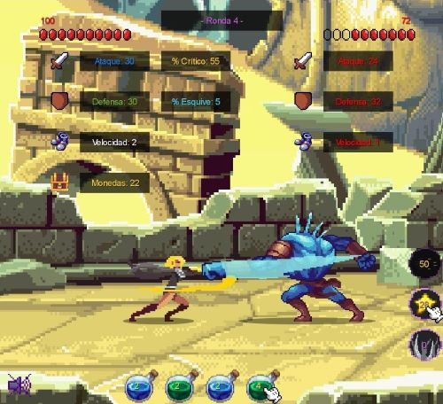

# "Clicker Hero"

## Equipo de Desarrollo

- Franco Modesto
- Matías Oliva
- Juan Pablo Castiglione
- María Guadalupe Fernández
- Abril Caruso

## Links

- Teórico: https://docs.google.com/document/d/1hbr5NnRzI0KIAWgHG1wK1nD987k4FxwzlqMqY79ZSWM

## Capturas

## Reglas de Juego / Instrucciones

## Otros

- UTN K2004/K2104
- Versión de Wollok: 3.0.0
- Una vez terminado, no tenemos problemas en que el repositorio sea público.
