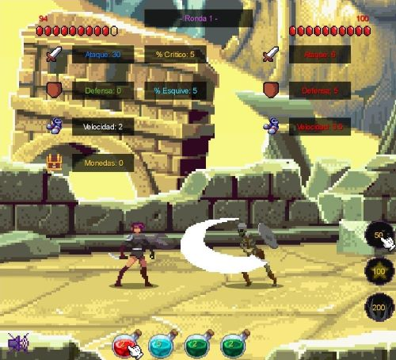

# "Clicker Hero"

## Equipo de Desarrollo

- Franco Modesto
- Matías Oliva
- Juan Pablo Castiglione
- María Guadalupe Fernández
- Abril Caruso

## Links

- Teórico: https://docs.google.com/document/d/1hbr5NnRzI0KIAWgHG1wK1nD987k4FxwzlqMqY79ZSWM

## Capturas

## Reglas de Juego / Instrucciones

Clicker Hero es un clicker-rpg totalmente lineal en el que no escribes tu propia historia limitandote a seguir un camino prefijado. Explora un mundo con 5 enemigos únicos. Los jugadores dan forma a las características del personaje con las compras de objetos y habilidades que realizan en la tienda a partir de las monedas que consiguen, definiendo el estilo de juego por el que cada uno desee optar. Aventúrate intentando aguantar el máximo de rondas posible, y compite con tus amigos para decidir quien es verdaderamente un héroe.

- Para comprar objetos, mueve el cursor con las teclas ← y →, adquiriéndolos con la tecla "E". Cada objeto aumentará de manera distinta las estádisticas del personaje. Descubre qué hace cada poción!
- Para comprar habilidades, mueve el cursor con las teclas ↑ y ↓, adquiriéndolas y usándolas con el espacio. Una vez que compres una habilidad, podrás usarla las veces que quieras. Descubre qué hace cada una de ellas!

## Otros

- UTN K2004/K2104
- Versión de Wollok: 3.0.0
- Una vez terminado, no tenemos problemas en que el repositorio sea público.
